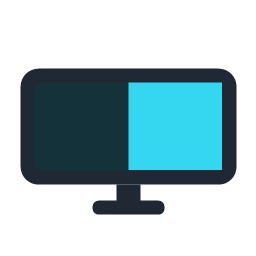
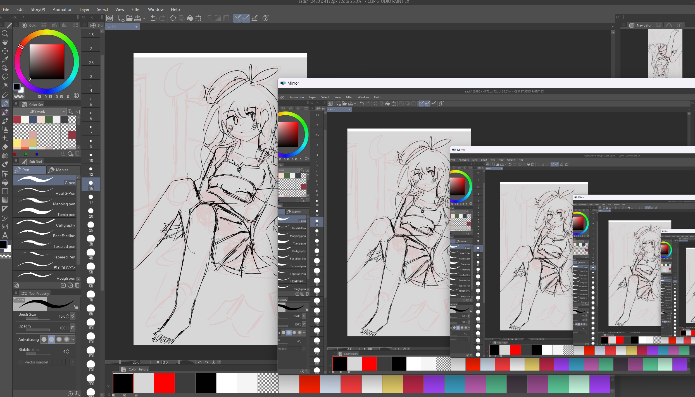
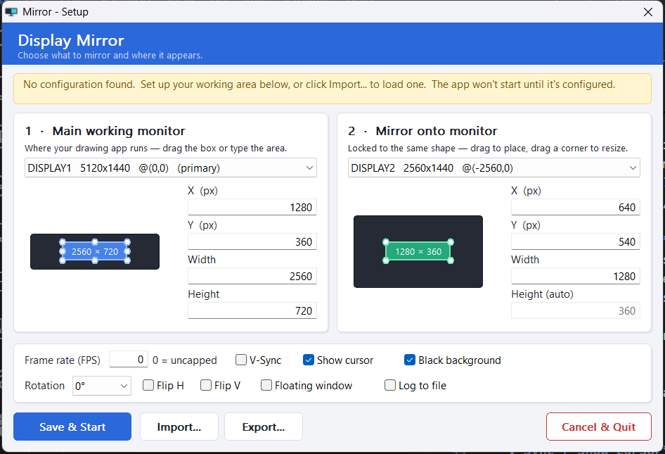

  

<h1 align="center">Monitor Mirror</h1>

  A simple monitor display mirroring tool — draw on the tablet,
  and see it live on your main monitor with almost no delay.

> **Windows 10 / 11 only** (64-bit). Not available for macOS or Linux.

---

## What it's for

This was built intended for people who prefer an easy software solution to draw in hybrid with pen display tablet (e.g. a Huion / Wacom pen display) mirroring the main monitor for better ergonomic.

Especially on an **ultrawide**: mirror just the slice you're working in onto
another screen (or a floating window) at true 1:1 — **no picture-in-picture supported monitor or
capture card needed**.

Can be use for other purposes such as OBS recording.

(Note that this is just a mirroring tool, it does not transfer pen pressure data. You have to configure your tablet driver to map the same area as the main monitor working area, and then mirror that to your drawing tablet. It's a workaround method.)

## Demo

Drawing on the pen display (right) shows live on the main monitor (left):

▶️ **[Watch the demo](preview.mp4)** (2 MB) · [full-quality `.mov`](preview.mov)

<!--
  WANT AN INLINE VIDEO PLAYER (like other repos)? GitHub only plays videos that
  were uploaded through its web editor, so this is a one-time manual step:
    1. Open this README on github.com and click the ✏️ Edit button.
    2. Click an empty line here, then drag `preview.mp4` (repo root) into the editor.
    3. GitHub uploads it and inserts a  https://github.com/finaea/monitor-mirror/assets/…
       URL that renders as an inline player. Commit. (You can then delete the link above.)
-->

## The setup window

Quick configurable UI - Pick your screens, drag (or type) the exact area to mirror, and go.

## Key features

- ⚡ **Ultra-low latency** — an all-GPU pipeline (DXGI Desktop Duplication → GPU
  crop → flip-model present). Under ~1 ms of added work; no CPU round-trip, no
  compositor frame. (Full breakdown in the [cpp README](cpp/README.md#how-fast-is-it-and-how-does-it-work).)
- 🖥️ **Visual setup** — pick the working monitor and the mirror monitor, drag a
  box or type exact pixels; the mirror area is **ratio-locked**.
- 🪟 **Floating-window mode** — mirror into a movable, resizable window that can
  share the **same** screen — no second monitor needed, and easy to capture in OBS.
- 🔄 **Rotation & flip** — 90° / 180° / 270° plus horizontal/vertical flip, for
  tablets mounted sideways or upside-down.
- 🎚️ **Tuning** — FPS cap, V-Sync, cursor on/off, and a black-out-background toggle.
- 🧷 **Robust config** — monitors are remembered by a **stable hardware id** (not
  just `\\.\DISPLAYx`), so re-plugging that renumbers displays won't break it.
  Import/export your settings as a `.cfg`.
- 🛟 **Self-healing** — on a display change, unplug, or bad config it re-opens the
  setup window and tells you exactly what's wrong. Optional `mirror.log` for
  diagnostics.
- 📌 **Lives in the tray** — left-click to toggle, right-click to edit or quit;
  uses zero resources when disabled.

---

## Just want to use it?

👉 **[Download the latest `mirror.exe`](https://github.com/finaea/monitor-mirror/releases/latest/download/mirror.exe)** (or browse [all releases](https://github.com/finaea/monitor-mirror/releases)).

That's the whole app — a single small file, no installer. Double-click it; the
first time, a setup window walks you through picking your screens and the area to
mirror. See the [`cpp`](cpp) README for full usage.

## What's in this project

| Folder | What it is |
|---|---|
| [`cpp/`](cpp) | **The app you should use.** Tiny, fastest, set up with a visual window. |
| [`python/`](python) | An **older version kept for reference/archival**. Same idea, but settings are edited in code instead of a window. |

A detailed side-by-side of the two versions lives in
[`python/build_compare.md`](python/build_compare.md).
